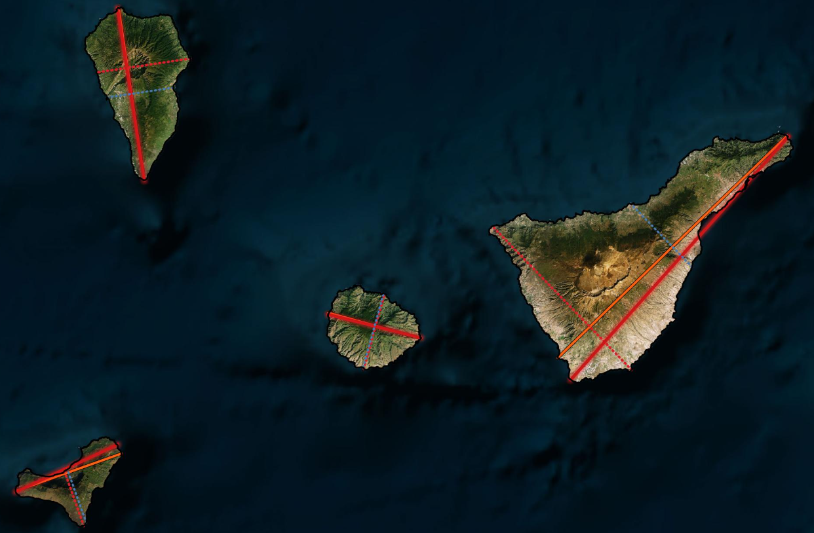
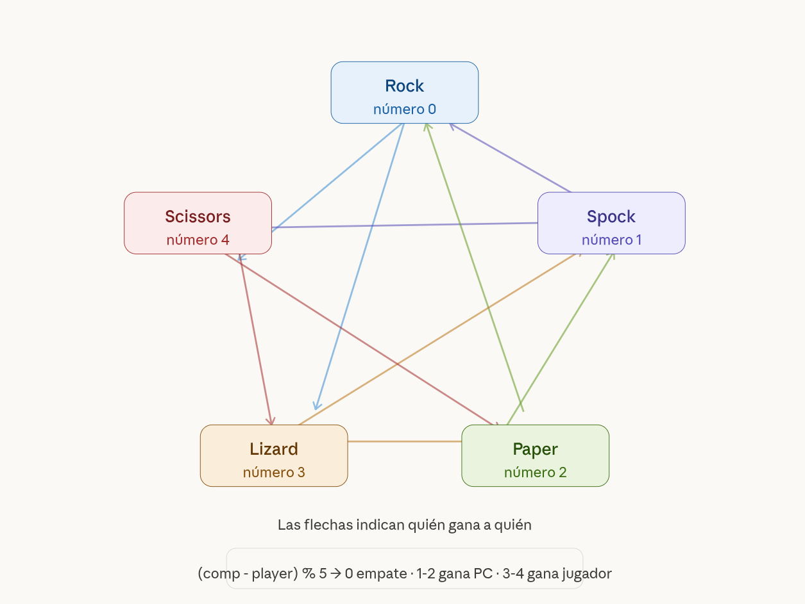

# GeoPython 2026

> **Análisis Espacial con Python** · Gabinete de Formación del CSIC  
> Estación Biológica de Doñana, Sevilla · 6–10 abril 2026



[](https://www.python.org/)
[](https://jupyter.org/)
[](https://docs.conda.io/)
[](LICENSE)

---

## Grabaciones de las sesiones

| Día | Contenido | Enlace |
|-----|-----------|--------|
| Día 1 | Intro Google Colab + Introducción a Python | [Ver grabación](https://balanbbb.corp.csic.es/playback/presentation/2.3/49d59d607ccc44671d0e0ada701426dd6a2dcfd4-1775458392383) |
| Día 2 | Clases en Python · Pandas · Stack vectorial | [Ver grabación](https://balanbbb.corp.csic.es/playback/presentation/2.3/49d59d607ccc44671d0e0ada701426dd6a2dcfd4-1775545152074) |
| Día 3 | Entorno Anaconda · Stack vectorial | [Ver grabación](https://balanbbb.corp.csic.es/playback/presentation/2.3/49d59d607ccc44671d0e0ada701426dd6a2dcfd4-1775631555977) |

---

## Entorno de trabajo

El curso es **mixto**: los dos primeros días trabajamos en Google Colab; a partir del Día 3 pasamos al entorno local con Anaconda.

### Días 1–2 — Google Colab

Accede en [colab.research.google.com](https://colab.research.google.com). Los notebooks incluyen una celda inicial con las instalaciones necesarias (`!pip install ...`).

### Días 3–5 — Entorno local (conda)

```bash
conda env create -f environment.yml
conda activate geopython2026
```

---

## Temario

### Día 1 — Introducción a Google Colab y a Python

[](https://github.com/Digdgeo/Geopython_2026/blob/main/dia_1/notebooks/01_intro_python_complete.ipynb)
[](https://github.com/Digdgeo/Geopython_2026/blob/main/dia_1/notebooks/01_intro_python_exercises.ipynb)

Primer contacto con Jupyter en Google Colab. Introducción a Python: tipos de datos, estructuras de control y funciones. Como ejercicio de cierre, el clásico **Rock, Paper, Scissors, Lizard, Spock** popularizado por The Big Bang Theory.

- Google Colab: entorno, atajos, integración con Drive
- Variables, strings, numbers, booleans
- Listas, tuplas, sets, diccionarios
- Bucles `for` / `while` y condicionales
- Manejo de errores (`try` / `except`)
- Funciones y módulos



---

### Día 2 — Clases en Python y Pandas

[](https://github.com/Digdgeo/Geopython_2026/blob/main/dia_1/notebooks/01b_python_classes.ipynb)
[](https://github.com/Digdgeo/Geopython_2026/blob/main/dia_1/notebooks/01c_pandas_dataframes.ipynb)

Terminamos los temas pendientes de Python (módulos, manejo de errores, clases) y damos el salto a **Pandas**, la librería de referencia para datos tabulares. Introducción a la Programación Orientada a Objetos con herencia.

- Clases en Python: `__init__`, métodos, atributos
- Herencia y polimorfismo
- Pandas: Series y DataFrames
- Lectura de CSV/Excel, indexado y filtrado
- Operaciones, agrupaciones y visualización básica


---

### Día 3 — Entorno Anaconda y stack vectorial

[](https://github.com/Digdgeo/Geopython_2026/blob/main/dia_2/introduccion_anaconda.md)
[](https://github.com/Digdgeo/Geopython_2026/blob/main/dia_2/notebooks/02_shapely_fiona_geopandas_complete.ipynb)
[](https://github.com/Digdgeo/Geopython_2026/blob/main/dia_2/notebooks/02_shapely_fiona_geopandas_exercises.ipynb)

Pasamos al entorno local con Anaconda y arrancamos con el análisis vectorial. La clave del día es entender cómo se construyen las librerías unas sobre otras:

```
GDAL/OGR  →  Fiona · Shapely  →  GeoPandas
```

- Anaconda: conda vs pip, entornos virtuales, `environment.yml`
- **Shapely**: geometrías, predicados y operaciones espaciales en memoria
- **Fiona**: I/O vectorial sobre GDAL/OGR, control fino del schema
- **GeoPandas**: análisis vectorial de alto nivel, CRS, spatial joins, overlay y visualización


---

### Día 4 — Stack raster: NumPy y Rasterio

> **Datos de la sesión:** [Descargar datos](https://saco.csic.es/s/7fwsC5oXLtRwtMe)

El mismo concepto aplicado al mundo raster:

```
GDAL  →  NumPy  →  Rasterio
```

- **GDAL** desde Python: drivers, metadatos, reproyección
- **NumPy**: arrays multidimensionales y álgebra de mapas
- **Rasterio**: lectura/escritura de rasters, clips, enmascarado, point sampling y estadísticas zonales


---

### Día 5 — Google Earth Engine: Geemap y ndvi2gif

*Viernes 10 de abril*

Cerramos el curso con acceso a la nube desde Python. Google Earth Engine como plataforma de computación geoespacial masiva, con Geemap como interfaz interactiva y ndvi2gif para series temporales de índices espectrales.

- **Google Earth Engine**: autenticación, colecciones de imágenes, filtros
- **Geemap**: mapas interactivos, composites estacionales, exportación
- **ndvi2gif**: composites multíndice y GIFs de series temporales
- **OSMnx**: redes viales, rutas óptimas e isocronas *(si da tiempo)*


---

## Librerías principales

| Librería | Versión mínima | Uso |
|----------|---------------|-----|
| geopandas | 1.0 | Análisis vectorial |
| shapely | 2.0 | Geometrías y operaciones espaciales |
| fiona | 1.9 | I/O vectorial (sobre GDAL/OGR) |
| rasterio | 1.3 | Análisis raster |
| numpy | 1.26 | Arrays y álgebra de mapas |
| pandas | 2.0 | Datos tabulares |
| matplotlib | 3.8 | Visualización |
| geemap | 0.30 | Google Earth Engine interactivo |
| osmnx | 1.9 | Redes viales |
| ndvi2gif | 1.1.0 | Composites estacionales y series temporales |
| jupyter | — | Entorno de trabajo |

---

## Datos

Los datos de ejemplo están en `data/` e incluyen capas vectoriales de Canarias, Tenerife y el entorno de Doñana (shapefiles, GeoPackage, GeoJSON).

---

*GeoPython 2026 · CSIC / Estación Biológica de Doñana*
